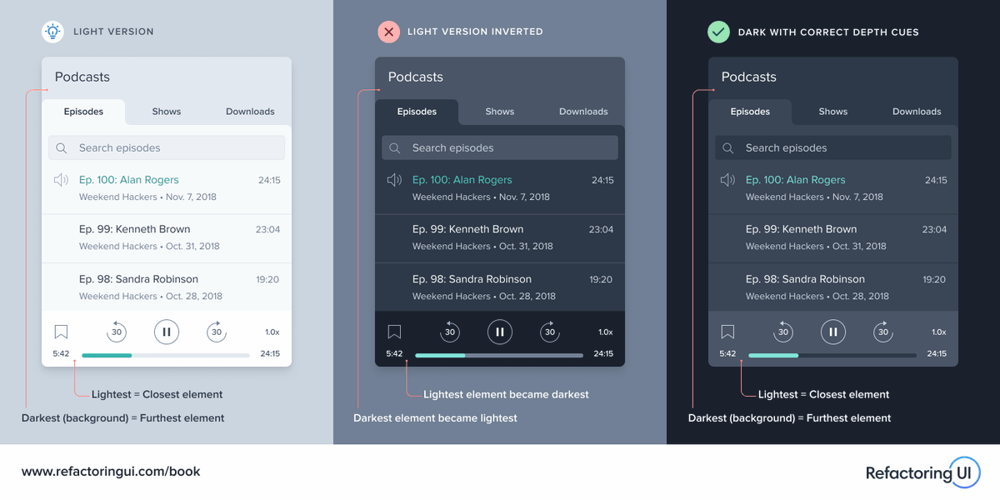
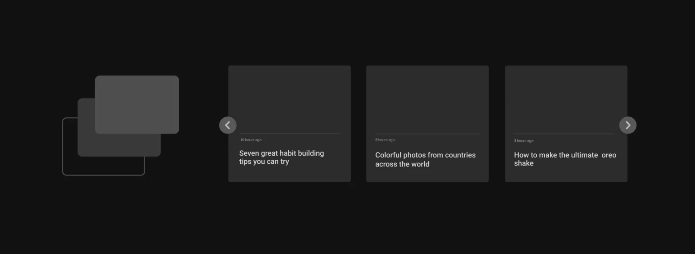

# LIGHT / DARK MODE NOTES

<br>

Several approaches:

1. body class
2. separate stylesheets
3. custom properties
4. server-side scripts

<br>

Can be combined.

<br><br>

## LIGHT / DARK MODE AT OS LEVEL

<br>
Many operating systems let users choose between light and dark themes directly in the system settings.
<br><br>

**This two ways will automatically "copy" the OS system preferences to the website. If OS is in dark mode, the website will also be in dark mode. And vice versa.**
<br><br>

### CSS only

<br>

CSS has a prefers-color-scheme media query which can be used to detect user’s system color scheme preferences. It can have three possible values: no preference, light and dark.
<br><br>

The prefers-color-scheme CSS media feature is used to detect if the user has requested a light or dark color theme.

The user might indicate this preference through an operating system setting (e.g. light or dark mode) or a user agent setting.
<br>

If a user has enabled dark mode from the system settings, they will get the dark mode styles by default. We don’t have to resort to JavaScript or server-side scripts to decide which mode to use.
**We don’t even need the button!**

[MDN prefers-color-scheme](https://developer.mozilla.org/en-US/docs/Web/CSS/@media/prefers-color-scheme)

<br><Bbr>

**Syntax**: `light` and `dark`

<br>

**Usage**:

<br>

HTML:

    <h1>This is a title</h1>

    <p>I am just a boring text, existing here solely for the purpose of this demo</p>

    <a href="#">I am a link</a>

<br><br>

CSS:

    body {
      color: #222;
      background: #fff;
      font: 100% system-ui;
    }
    a {
      color: #0033cc;
    }

    @media (prefers-color-scheme: dark) {
      body {
        color: #eee;
        background: #121212;
      }

      body a {
        color: #809fff;
      }
    }

<br><br>

### CSS + JS

<br>

The `Window` interface's `matchMedia()` method returns a new `MediaQueryList` object that can then be used to determine if the `document` matches the `media query` string, as well as to monitor the document to detect when it matches (or stops matching) that media query.
<br>

We can turn to JavaScript to detect the user’s preferred color scheme. This is a lot like the CSS method, only we’re using `matchedMedia()` to detect the user’s preference.
<br>

We can swap stylesheets instead like with CSS. This time, we link up both stylesheets and use the media query to determine which one is applied.
<br>

**Downside**: there will likely be a quick flash of the light theme as JavaScript is executed after the CSS.

<br><br>

[MDN matchMedia()](https://developer.mozilla.org/en-US/docs/Web/API/Window/matchMedia)
<br>

**Syntax**:

    mqList = window.matchMedia(mediaQueryString)

<br>

**Usage**:

<br>

HTML:

    <h1>This is a title</h1>

    <p>I am just a boring text, existing here solely for the purpose of this demo</p>

    <a href="#">I am a link</a>

<br><br>

CSS:

    body {
      background: #fff;
      font: 100% system-ui;
    }

    h1,
    p {
      color: #222;
    }

    body.dark-theme {
      background: #121212;
    }
    body.dark-theme h1,
    body.dark-theme p {
      color: #eee;
    }
    body.dark-theme a {
      color: #809fff;
    }

<br><br>

JS:

```js
const prefersDarkScheme = window.matchMedia("(prefers-color-scheme: dark)");

if (prefersDarkScheme.matches) {
  document.body.classList.add("dark-theme");
} else {
  document.body.classList.remove("dark-theme");
}
```

<br><br>

---

<br>

## OVERRIDING OS LIGHT / DARK SETTINGS

<br>

Enabling user to manually toggle dark / light mode.
<br>

**in CSS**:

- define the custom properties for both themes

- wrap dark styles up in the `prefers-color-scheme` media query

- define a `.light-theme` class inside of that we can use to override the dark mode properties, should the user want to toggle between the two modes

<br>

    /* Default colors */

    body {
      --text-color: #222;
      --bkg-color: #fff;
    }

    /* Dark theme colors */

    body.dark-theme {
      --text-color: #eee;
      --bkg-color: #121212;
    }

    /* Styles for users who prefer dark mode at the OS level */

    @media (prefers-color-scheme: dark) {
      /* defaults to dark theme */
      body {
        --text-color: #eee;
        --bkg-color: #121212;
      }

      /* Override dark mode with light mode styles if the user decides to swap */

      body.light-theme {
        --text-color: #222;
        --bkg-color: #fff;
      }
    }

<br><br>

### Having a toggle button

<br>

**= respecting the OS color preference by default**

**= allowing the user to manually switch themes**

<br><br>

JS:

```js
// Listen for a click on the button
btn.addEventListener("click", function () {
  // If the OS is set to dark mode...
  if (prefersDarkScheme.matches) {
    // ...then apply the .light-theme class to override those styles
    document.body.classList.toggle("light-theme");

    // Otherwise...
  } else {
    // ...apply the .dark-theme class to override the default light styles
    document.body.classList.toggle("dark-theme");
  }
});
```

<br><br>

---

## STORING USER'S PREFERENCE

<br>

**How to carry it over when the user either visits another page on the site or reloads the current page.**

<br>

We need to save the user’s choice so that it will be applied consistently throughout the site and on subsequent visits. To do that, we can save the user’s choice to the localStorage when the theme is toggled.
(Also possible with Cookies + PHP = server side approach).
<br>

### Using localStorage

<br>

`Window.localStorage`
<br>

The `localStorage` read-only property of the `window` interface allows you to access a `Storage` object for the `Document`'s `origin`; the stored data is saved across browser sessions.

`localStorage` is similar to `sessionStorage`, except that while `localStorage` **data has no expiration time**, `sessionStorage` data gets cleared when the page session ends — that is, when the page is closed. (`localStorage` data for a document loaded in a "private browsing" or "incognito" session is cleared when the last "private" tab is closed.)
<br><br>

The keys and the values stored with `localStorage` are always in the UTF-16 DOMString format, which uses two bytes per character. As with objects, integer keys are automatically converted to strings.

<br>

`localStorage` **data is specific to the protocol of the document**. In particular, for a site loaded over HTTP (e.g., `http://example.com`), `localStorage` returns a different object than `localStorage` for the corresponding site loaded over HTTPS (e.g., `https://example.com`).

<br>

[MDN local storate](https://developer.mozilla.org/en-US/docs/Web/API/Window/localStorage)
<br><br>

**Use case**:

<br>

We have a script that saves the selected theme to `localStorage` when the toggle takes place. In other words, when the page is reloaded, the script fetches the choice from localStorage and applies it.
JavaScript is often executed after CSS, so this approach is prone to a _“flash of incorrect theme” (FOIT)_.
<br><br>

JS:

```js
// Select the button
const btn = document.querySelector(".btn-toggle");

// Select the theme preference from localStorage
const currentTheme = localStorage.getItem("theme");

// If the current theme in localStorage is "dark"...
if (currentTheme == "dark") {
  // ...then use the .dark-theme class
  document.body.classList.add("dark-theme");
}

// Listen for a click on the button
btn.addEventListener("click", function () {
  // Toggle the .dark-theme class on each click
  document.body.classList.toggle("dark-theme");

  // Let's say the theme is equal to light
  let theme = "light";
  // If the body contains the .dark-theme class...
  if (document.body.classList.contains("dark-theme")) {
    // ...then let's make the theme dark
    theme = "dark";
  }

  // Then save the choice in localStorage
  localStorage.setItem("theme", theme);
});
```

<br><br>

---

<br>

## DEMO

<br>

**Combines everything**
<br>

1. Automatically load a dark or light theme **based on OS preferences**.

2. Allow the user to manually override their system preference with **toggle button**.

3. Maintains the user’s preferred theme on page reloads with **`localStorage`**.

<br><br>

---

<br>

## Design considerations

<br>

### IMAGES

<br>

Decrease the brightness and contrast a bit.
<br>

CSS `filter()`
<br>

    /* Apply the filter directly on the body tag */
    body.dark-theme img {
      filter: brightness(.8) contrast(1.2);
    }

    /* Or apply it via media query */
    @media (prefers-color-scheme: dark) {
      img {
        filter: brightness(.8) contrast(1.2);
      }
    }

<br><br>

HTML <picture> element can load different versions of an image + prepare 2 images in PS
<br>

    <picture>

      <!-- Use this image if the user's OS setting is light or unset -->
      <source srcset="photo-light.png" media="(prefers-color-scheme: light) or (prefers-color-scheme: no-preference)">

      <!-- Use this image if the user's OS setting is dark -->
      <source srcset="photo-dark.png" media="(prefers-color-scheme: dark)">

    </picture>

<br><br>

## DEPTH

<br>

Close elements should still be lighter and distant elements should still be darker – even in a dark UI.
<br>


<br><br>

Use **opacity** to convey **depth** (with high opacity regions having a lower depth).
Elements that have a higher elevation should have a lower opacity than elements that are “closer” in depth to the background.
<br>


<br><br>

### TYPOGRAPHY

<br>

Balance the contrast.
Use too heavy of a font and we get blaring text that’s makes us want to move away from the screen. Use too light of a font and we’ll strain our eyes while inching toward the screen to get a closer look.
<br>

**Variable fonts**
<br>

Use a lighter font weight to make the text easier to read whenever dark mode is active
<br>

CSS:

    /* normal font weight: 400; */

    body {
      font-weight: 400;
    }

    @media (prefers-color-scheme: dark) {
      body {
        font-weight: 350;
      }
    }

<br><br>

HTML >> HEAD >> Google font link:

- **declare which range of font-weight values** `@300..500`
- download those two values `@300;500`
  <br><br>

        <link href="https://fonts.googleapis.com/css2?family=Yanone+Kaffeesatz:wght@300..500&display=swap" rel="stylesheet">

---

### Resources

<br>

[A Complete Guide to Dark Mode on the Web](https://css-tricks.com/a-complete-guide-to-dark-mode-on-the-web/)
