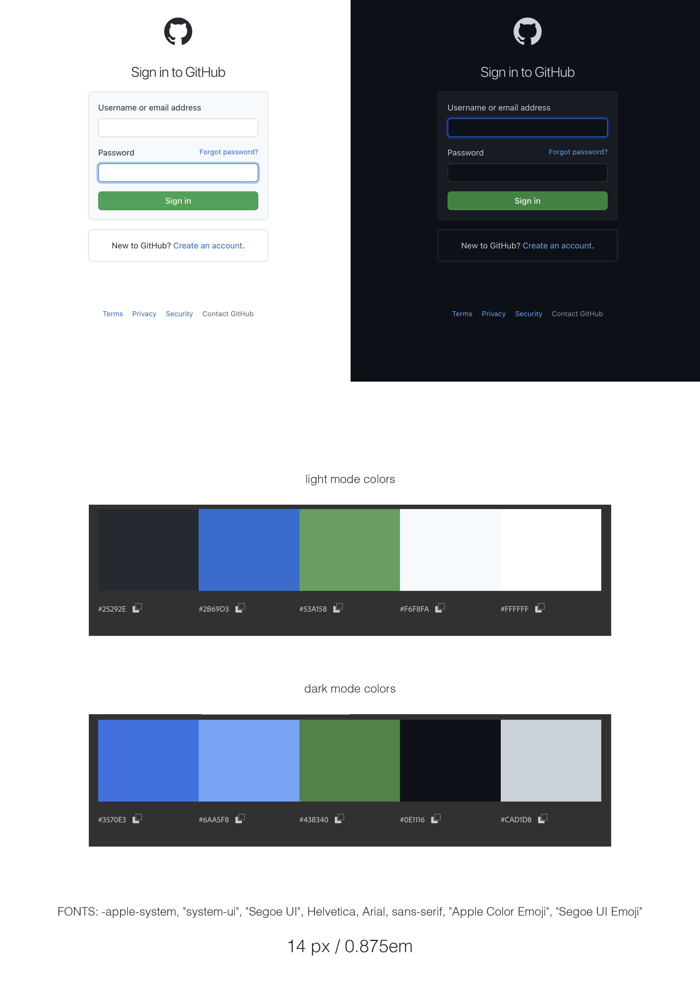

# GitHub Login Page remake

 

This is an exercise in remaking a login page for GitHub, in both light and dark mode. It also contains a few other features listed below.

  

---

## Technologies:

- HTML5

- CSS3 + SCSS (mixins, variables)

- JavaScript

  

---

## Features

 

- CSS divided into SASS components

  

---

## Improvement ideas

 

[] button for user to chande dark / light mode

[] input validation

  

---

## Mockup

 

  

---

## Try it!

  

---

### Sources:

 

**Articles:**
 

1. [A Complete Guide to Dark Mode on the Web](https://css-tricks.com/a-complete-guide-to-dark-mode-on-the-web/)

- comprehensive
- storage of user's preferences

  

2. [Toggle Dark Mode](https://www.w3schools.com/howto/howto_js_toggle_dark_mode.asp)

  

3. [Adding Dark Mode with CSS & JavaScript](https://academind.com/tutorials/adding-dark-mode)

- SCSS
- transition

  

4. [Create a user controlled dark or light mode](https://piccalil.li/tutorial/create-a-user-controlled-dark-or-light-mode/)

- makes change with media query
   

- honors user OS default mode

 

[MDN prefers color scheme](https://developer.mozilla.org/en-US/docs/Web/CSS/@media/prefers-color-scheme)

The `prefers-color-scheme` CSS media feature is used to detect if the user has requested a light or dark color theme.

The user might indicate this preference through an operating system setting (e.g. light or dark mode) or a user agent setting.

  

5. [How to create a dark\light mode switch in CSS and Javascript](https://codyhouse.co/blog/post/dark-light-switch-css-javascript)

  

**YT:**
  

1. [Light & Dark Mode with CSS Variables](https://www.youtube.com/watch?v=6YrOGKmGTCY&list=PLmGRn_VnTuAxIHKjfgoOEOIk72PeZdbaB&index=48)

a: https://www.youtube.com/watch?v=6YrOGKmGTCY

b: https://www.youtube.com/watch?v=pZhAiCSqHPs

c: https://www.youtube.com/watch?v=uO3RF_67re8

d:

 

2. [How to create a dark\light mode switch in CSS and Javascript](https://www.youtube.com/watch?v=py3W80hMuzE)

   [GitHub dark/light mode switch from the video](https://github.com/CodyHouse/dark-light-mode-switch)

  

---

### Licence

[MIT](https://choosealicense.com/licenses/mit/)
