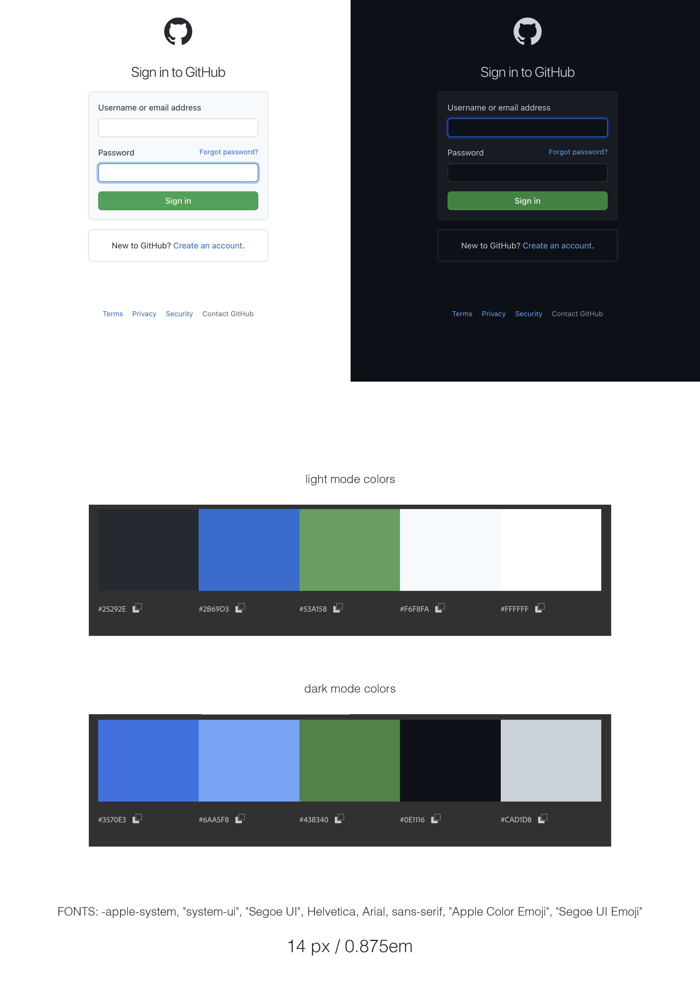

# GitHub Login Page remake

 

This is an exercise in remaking a login page for GitHub, in both light and dark mode. It also contains a few other features listed below.

  

---

## Technologies:

 

- HTML5

- CSS3, SCSS

- JavaScript

 

- uses `localStorage`

- additional script with `sessionStorage` version

- CSS custom properties

- `prefers-color-scheme`

  

---

## Features

 

- auto-detects OS theme preference

- option for manually switching light/dark mode

- client-side form validation

- customizable error messages

  

---

## Improvement ideas

 

[x] button for user to chande dark / light mode

[x] input validation

[ ] dynamically change favicon

[ ] implement SCSS

  

---

## Mockup

 

  

---

## Try it!

 

[GitHub login page](https://emarekica.github.io/github-login-remake/)

  

---

### Sources:

 

**Articles:**
 

- [A Complete Guide to Dark Mode on the Web](https://css-tricks.com/a-complete-guide-to-dark-mode-on-the-web/)

- comprehensive
- storage of user's preferences

  

- [Create a user controlled dark or light mode](https://piccalil.li/tutorial/create-a-user-controlled-dark-or-light-mode/)

- makes change with media query

- honors user OS default mode

 

- [MDN prefers color scheme](https://developer.mozilla.org/en-US/docs/Web/CSS/@media/prefers-color-scheme)

  

---

### Licence

[MIT](https://choosealicense.com/licenses/mit/)
